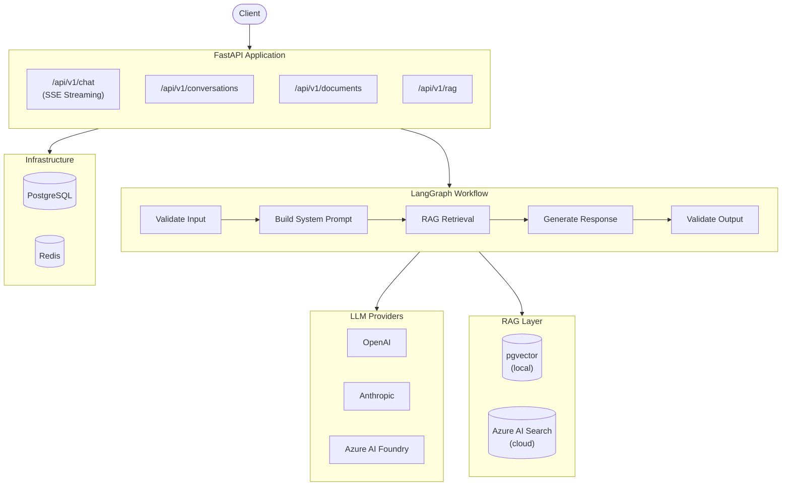
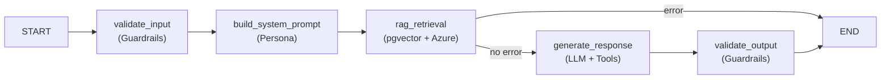

# AI Lab — Enterprise AI Platform

A production-ready, **ChatGPT Enterprise-style** AI platform built with Python 3.12+, FastAPI, LangChain, LangGraph, and a clean multi-provider architecture.

---

## Architecture Overview



---

## Features

| Feature | Implementation |
|---|---|
| **Multi-provider LLM** | OpenAI, Anthropic, Azure AI Foundry |
| **Streaming** | SSE via `AsyncGenerator` + FastAPI `StreamingResponse` |
| **Tool Calling** | WebSearch, Calculator, DateTime, URLFetcher, DocumentSearch |
| **RAG Hybrid** | pgvector (local) + Azure AI Search (cloud) + reranking |
| **Personas** | YAML-driven Jinja2 templates (4 built-in) |
| **Guardrails** | Jailbreak detection, PII masking, topic blocking |
| **Structured Output** | Pydantic v2 models throughout |
| **Observability** | OpenTelemetry + LangSmith tracing + structlog |
| **Retry Policies** | tenacity exponential backoff on all providers |
| **Auth** | API key authentication (`X-API-Key` header) |
| **Rate Limiting** | SlowAPI per-IP |
| **Document Processing** | PDF, DOCX, XLSX, PPTX, TXT, Markdown, code files |
| **Migrations** | Alembic with pgvector HNSW index |
| **Dev Container** | One-command onboarding via VS Code |

---

## Quick Start

### Option 1: Docker Compose (Recommended)

```bash
git clone https://github.com/pedromussolin/ai-lab.git
cd ai-lab
cp .env.example .env
# Edit .env with your API keys
vim .env

# Start infrastructure + run migrations
docker compose up -d db redis
docker compose run --rm migrate

# Start the API
docker compose up api
```

API available at: **http://localhost:8000**  
Swagger UI: **http://localhost:8000/docs**

---

### Option 2: VS Code Dev Container (Zero-config)

```bash
git clone https://github.com/pedromussolin/ai-lab.git
cd ai-lab
code .
```

Then: **`Ctrl+Shift+P` → "Dev Containers: Reopen in Container"**

The container will:
1. Build the Python 3.12 environment
2. Start PostgreSQL + Redis
3. Run Alembic migrations
4. Configure VS Code with all extensions

Then start the API with hot reload:
```bash
uvicorn app.main:app --reload
```

---

## Configuration

Copy `.env.example` to `.env` and configure:

```bash
# Required for basic chat
OPENAI_API_KEY=sk-...
API_KEY=your-api-key          # X-API-Key header value

# Optional providers
ANTHROPIC_API_KEY=sk-ant-...
AZURE_OPENAI_API_KEY=...
AZURE_OPENAI_ENDPOINT=https://...

# Optional: Azure AI Search for cloud RAG
AZURE_SEARCH_ENDPOINT=https://...
AZURE_SEARCH_API_KEY=...

# Optional: LangSmith tracing
LANGCHAIN_API_KEY=...
LANGCHAIN_PROJECT=ai-lab
```

---

## API Reference

All endpoints require `X-API-Key: <your-key>` header.

### Chat

```http
# Non-streaming chat
POST /api/v1/chat
Content-Type: application/json
X-API-Key: your-api-key

{
  "message": "What is the capital of France?",
  "conversation_id": null,
  "persona_id": "assistant_default",
  "provider": "openai",
  "model": "gpt-4o",
  "use_rag": true,
  "tools_enabled": true
}
```

```http
# Streaming chat (SSE)
POST /api/v1/chat/stream
```

SSE response format:
```
data: {"type":"chunk","content":"Paris","conversation_id":"...","message_id":"..."}
data: {"type":"citation","citation":{"source":"doc.pdf","confidence":0.95}}
data: {"type":"done","conversation_id":"...","message_id":"..."}
data: [DONE]
```

### Conversations

```http
GET  /api/v1/conversations          # List conversations
POST /api/v1/conversations          # Create conversation  
GET  /api/v1/conversations/{id}     # Get with messages
DELETE /api/v1/conversations/{id}   # Delete
```

### Documents

```http
# Upload a document
POST /api/v1/documents/upload
Content-Type: multipart/form-data

# Process (chunk + embed + index)
POST /api/v1/documents/process
{ "document_id": "...", "chunk_size": 1000, "indexing_strategy": "hybrid" }

# Get document status
GET /api/v1/documents/{id}
```

### RAG

```http
POST /api/v1/rag/query
{ "query": "what does the contract say about payment?", "top_k": 5 }
```

### Guardrails

```http
POST /api/v1/guardrails/validate
{ "text": "...", "config": "default" }
```

---

## Project Structure

```
ai-lab/
├── app/
│   ├── main.py                    # FastAPI app factory
│   ├── core/
│   │   ├── config.py              # pydantic-settings
│   │   ├── database.py            # SQLAlchemy async engine
│   │   ├── dependencies.py        # FastAPI DI
│   │   ├── exceptions.py          # Custom exceptions
│   │   └── security.py            # API key auth
│   ├── providers/                 # LLM adapters
│   │   ├── base.py                # Abstract interfaces
│   │   ├── openai_provider.py
│   │   ├── anthropic_provider.py
│   │   ├── azure_provider.py
│   │   └── factory.py
│   ├── tools/                     # Tool calling system
│   │   ├── base.py
│   │   ├── web_search.py
│   │   ├── calculator.py
│   │   ├── datetime_tool.py
│   │   ├── url_fetcher.py
│   │   ├── document_search.py
│   │   └── registry.py
│   ├── rag/                       # RAG pipeline
│   │   ├── chunker.py             # Recursive token-aware chunker
│   │   ├── indexer.py             # pgvector + Azure AI Search
│   │   ├── retriever.py           # Hybrid retrieval
│   │   ├── reranker.py            # Score-based reranking
│   │   └── pipeline.py            # Unified RAG pipeline
│   ├── workflows/
│   │   ├── states.py              # TypedDict states
│   │   └── chat_workflow.py       # LangGraph graph
│   ├── prompts/                   # Jinja2 templates
│   ├── personas/                  # YAML persona configs
│   ├── guardrails/                # Input/output validation
│   ├── models/                    # SQLAlchemy ORM models
│   ├── schemas/                   # Pydantic v2 schemas
│   ├── repositories/              # Async DB access layer
│   ├── services/                  # Business logic
│   ├── api/v1/                    # FastAPI routers
│   ├── middleware/                # Logging, rate limiting
│   └── observability/             # OTel, structlog, metrics
├── migrations/                    # Alembic migrations
├── tests/                         # pytest suite
├── .devcontainer/                 # VS Code Dev Container
├── docker-compose.yml
├── Dockerfile
└── .env.example
```

---

## LangGraph Workflow



**Tool calling loop**: The `generate_response` node executes tool calls automatically (up to 5 iterations) before returning the final response.

---

## Personas

Built-in personas (YAML templates in `app/personas/templates/`):

| Slug | Description |
|---|---|
| `assistant_default` | General-purpose assistant |
| `enterprise_consultant` | Business strategy & ROI focus |
| `technical_architect` | Software architecture & code |
| `researcher` | Evidence-based, citation-heavy |

Use via: `POST /api/v1/chat` with `"persona_id": "technical_architect"`

---

## Running Tests

```bash
# All tests
pytest

# With coverage
pytest --cov=app --cov-report=html

# Specific test
pytest tests/unit/test_tools.py -v
```

---

## Database Migrations

```bash
# Apply migrations
alembic upgrade head

# Create new migration
alembic revision --autogenerate -m "add new table"

# Rollback
alembic downgrade -1
```

---

## Troubleshooting

**`ProviderError: Provider 'openai' is not configured`**  
→ Set `OPENAI_API_KEY` in your `.env` file.

**`Connection refused` on port 5432**  
→ Ensure PostgreSQL is running: `docker compose up -d db`

**Migrations fail with `relation already exists`**  
→ The pgvector extension must be enabled: `CREATE EXTENSION IF NOT EXISTS vector;`

**Azure AI Search returns no results**  
→ Ensure `AZURE_SEARCH_ENDPOINT` and `AZURE_SEARCH_API_KEY` are set, and documents have been indexed via `/api/v1/documents/process`.

**Dev Container won't start**  
→ Ensure Docker Desktop is running with WSL2 integration enabled.

---

## Security Notes

- Never commit `.env` (it's in `.gitignore`)
- Rotate `API_KEY` and `SECRET_KEY` in production
- Enable HTTPS in production (use a reverse proxy like nginx or Traefik)
- Restrict `cors_origins` to your frontend domain in production

---

## Extending the Platform

### Add a new LLM Provider

1. Create `app/providers/my_provider.py` implementing `BaseLLMProvider`
2. Register in `app/providers/factory.py`:
   ```python
   _LLM_REGISTRY["my_provider"] = MyProvider
   ```

### Add a new Tool

1. Create `app/tools/my_tool.py` implementing `BaseTool`
2. Register in `app/tools/registry.py`

### Add a new Persona

1. Create `app/personas/templates/my_persona.yaml`
2. Persona is auto-loaded on startup

---

## Tech Stack

- **Runtime**: Python 3.12, FastAPI, Uvicorn, AsyncIO
- **LLM**: LangChain 0.3, LangGraph 0.2, LangSmith
- **Database**: PostgreSQL 16, pgvector, SQLAlchemy 2.0 (async)
- **Search**: Azure AI Search (hybrid + semantic)
- **Observability**: OpenTelemetry, structlog
- **Resilience**: tenacity (exponential backoff)
- **Auth**: API key, SlowAPI rate limiting
- **Testing**: pytest, pytest-asyncio, httpx
- **Dev**: VS Code Dev Containers, Ruff, Black
